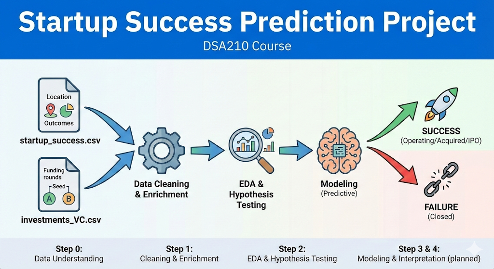

<p align="center">
  
</p>
<br>

# Startup Success Prediction Project

This project is for the DSA210 course. The goal is to study which **early observable features** of startups are associated with **eventual success or failure**, using a combination of:

- A **startup outcome dataset** (`startup_success.csv`)
- A **funding composition dataset** (`investments_VC.csv`)

Success is defined as the startup being *operating / acquired / IPO*, while failure is defined as *closed*.

---

## 1. Datasets

All raw data are under the `data/` folder:

- `startup_success.csv` – startup outcomes, locations, basic funding info and relationships.
Resource: https://www.kaggle.com/datasets/manishkc06/startup-success-prediction
- `investments_VC.csv` – detailed funding amounts per round type (seed, A, B, …).
Resource: https://www.kaggle.com/datasets/arindam235/startup-investments-crunchbase/

The project **enriches** the main outcome dataset (`startup_success.csv`) with round-level funding information from `investments_VC.csv`.

---

## 2. Project Steps

The project is organized into several steps that roughly follow the course structure:

1. **Step 0 – Data Understanding (conceptual)**
   - Read the dataset descriptions and course notes.
   - Decide what “success” means and which variables might be useful (e.g., number of rounds, relationships, early funding, timing of first funding).

2. **Step 1 – Data Cleaning & Enrichment**
   - Load both CSV files, handle encoding issues.
   - Create a common startup identifier (normalized company name) to **merge** the two datasets.
   - Parse date and funding columns into usable numeric and datetime formats.
   - Construct a *clean, merged table* (`data`) that will be used in later steps.

3. **Step 2 – Exploratory Data Analysis (EDA) & Hypothesis Testing**
   - Check class balance of the success label.
   - Summarize key variables (funding amounts, number of rounds, relationships, average participants, timing of first funding).
   - Define simple **derived features** (for example):
     - relationships per round,
     - early total funding,
     - age at first funding,
     - outcome-based age (from founding to closed/acquired/snapshot date),
     - simple seed ratios.
   - Formulate and test a small set of hypotheses (H1–H6) with two-sample t-tests, focusing on:
     - whether **network intensity** (e.g., relationships per round, investors per round),
     - **timing of first funding**, and
     - **early funding size / seed proportions**
     are statistically different between successful and failed startups.

4. **Step 3 – Modeling**
   - Modeling is done in a separate notebook (`ML.ipynb`) using the feature table exported at the end of Step 2 (as a **parquet** file).
   - Features used:
     - `rel_per_round`, `avg_participants`, `age_first_funding_year`,
       `early_total_funding_usd`, `seed_share_total`, `seed_over_avg_round`
   - Models:
     - Baseline: Dummy classifier (always predicts the majority class)
     - Logistic Regression
     - Decision Tree (GridSearchCV)
     - Random Forest (GridSearchCV)
   - Evaluation:
     - Accuracy, Precision, Recall, F1, ROC-AUC + Confusion Matrix
   - Thresholding:
     - **0.50 default threshold** (standard classification cutoff)
     - Additionally, a threshold sweep is performed to show the precision/recall trade-off.

5. **Step 4 – Interpretation & Reporting (planned)**
   - Summarize which early features are most informative in the model.
   - Compare modeling results with the earlier hypothesis tests.
   - Discuss limitations (data collection bias, survivorship bias, timing effects) and possible future improvements.

---

## 3. Repository Structure

```text
data/
    startup_success.csv
    investments_VC.csv
    processed/
      step2_dataset.parquet

EDA & Hypothesis Testing.ipynb     # Step 1 (cleaning/merging) + Step 2 (EDA & H1–H6 tests)
ML.ipynb      # Step 3 (modeling + threshold sweep + feature importance)
image.png     # Cover Image
README.md     # This file
