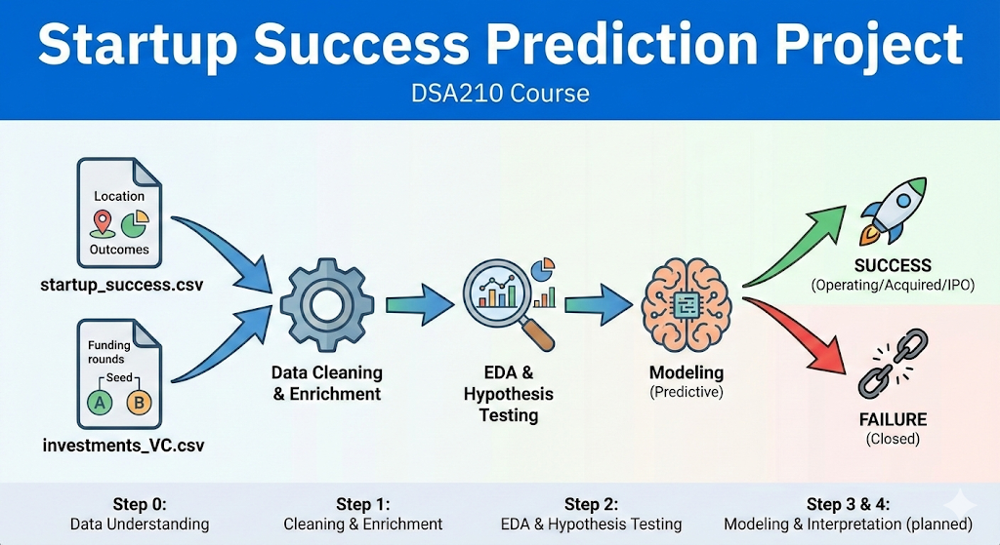

<p align="center">
  
</p>

# Startup Success Prediction (DSA210 Term Project)

This project studies which **early observable features** of startups are associated with eventual **success vs failure**, and builds a classifier to predict outcomes.

- **Success**: operating / acquired / IPO  
- **Failure**: closed

The workflow is: data preparation → hypothesis testing (Step 2) → machine learning → interpretation & limitations.

---

## Key Findings (Final)

### Step 2 — Hypothesis Testing Summary (H1–H6)

We tested six hypotheses using a merged dataset. Results:

- **H1 – Network intensity (`rel_per_round`)**  
  Successful startups have **higher relationships per funding round** than failed startups (**p ≪ 0.001**).

- **H2 – Investor crowding (`avg_participants`)**  
  Successful startups have **more investors per round on average** than failed startups (**p ≪ 0.001**).

- **H3 – Time to first funding (`age_first_funding_year`)**  
  Successful startups reach their **first funding slightly earlier** than failed startups (**p ≈ 0.03**).

- **H4 – Early funding amount (`early_total_funding_usd`)**  
  Successful startups raise **more early funding** than failed startups (**p < 0.001**).

- **H5 – Robustness across startup age groups (0–5, 5–10, 10+ years)**  
  The H1 effect (higher `rel_per_round` for successful startups) stays **statistically significant** in the 0–5 and 5–10 groups.  
  The 10+ group shows the **same direction**, but results are **not conclusive** due to smaller sample size.

- **H6 – Seed ratios among non–seed-only startups**  
  Among startups that raised both seed and later rounds, **seed-vs-later relative size ratios do not significantly differ** between success and failure.  
  In this subgroup, seed ratio comparisons **do not help distinguish** successful vs failed startups.

---

## Machine Learning Results (Final)

- **Baseline (Dummy / majority class) accuracy:** ≈ **0.649**  
  → Accuracy alone is not enough for evaluation.

- **Best model (by ROC-AUC on test):** **Tuned Random Forest**  
  - **Test ROC-AUC:** ≈ **0.788**

### Threshold sensitivity (important)
- At **threshold = 0.50** (default):  
  - **Accuracy ≈ 0.741**, **Precision ≈ 0.790**, **Recall ≈ 0.817**
- At a **lower threshold (~0.25–0.30)** (recall-oriented):  
  - **Recall increases to ~0.925–0.958**, but with **more false positives**

### Most important features (Random Forest)
1. `rel_per_round` (highest)
2. `avg_participants`
3. `age_first_funding_year`
4. `early_total_funding_usd`
5. seed-related ratios (lower importance than the above)

---

## Data Sources

This project merges two datasets:

- `startup_success.csv` — startup outcomes (status label and basic descriptors)
- `investments_VC.csv` — detailed funding composition by round type (seed, A, B, …)

Success is defined using the status label as:
- success = operating / acquired / IPO
- failure = closed

---

## Repository Structure
```text
DSA210-startup-success/
├── data/
│ ├── startup_success.csv
│ └── investments_VC.csv
├── processed/
│ └── step2_dataset.parquet
├── EDA & Hypothesis Testing.ipynb
├── ML.ipynb
├── image.png
├── requirements.txt
└── README.md
```
---

## Methodology

### Step 1 — Data Cleaning & Merge
- Cleaned identifiers, handled duplicates/missing values
- Converted numeric fields into consistent formats
- Produced a unified dataset and saved it to:
  - `processed/step2_dataset.parquet`

### Step 2 — EDA + Hypothesis Testing
- Compared success vs failure groups for each feature
- Used appropriate statistical tests (numerical and categorical)
- Reported p-values and robustness checks (age subgroup analysis)

### Step 3 — Machine Learning
- Train/test evaluation using multiple classifiers
- Selected model by **ROC-AUC on test**
- Reported threshold trade-offs (precision vs recall)

### Step 4 — Interpretation & Reporting (Completed)
Interpretation focused on connecting Step 2 statistical results to model behavior:

- The strongest signal in both hypothesis tests and ML importance is **network intensity per round (`rel_per_round`)**, suggesting that “how connected a startup is relative to its fundraising activity” is a key discriminator.
- **Investor crowding (`avg_participants`)** and **earlier first funding (`age_first_funding_year`)** add predictive value, aligning with the idea that early investor attention and faster first funding correlate with later success.
- **Early total funding (`early_total_funding_usd`)** is important, but the model is not purely “funding = success”; threshold choice changes the balance between catching more true successes and creating more false positives.
- **Seed ratios** contribute less and do not differentiate success/failure within the subgroup where they are defined (consistent with Step 2 H6).

---

## Reproducibility

### Setup
```bash
python -m venv .venv
# Windows: .venv\Scripts\activate
# macOS/Linux: source .venv/bin/activate
pip install -r requirements.txt
```

### Verification
All reported results were taken from executed notebook outputs. AI suggestions were treated as drafts and only kept after checking against actual runs.

---

## Limitations

- **Small feature set:** Only 6 numeric features are used; richer pre-funding signals could improve generalization.
- **Potential leakage risk:** Funding-related variables may indirectly encode post-outcome dynamics depending on dataset construction.
- **Threshold selection:** In practice, the decision threshold should be chosen on a validation set (or within cross-validation), not on the test set.
- **Imbalance & costs:** The "best" model/threshold depends on real-world costs of false positives vs false negatives.

---

## AI Assistance Disclosure

Generative AI tools (e.g., ChatGPT) were used as a productivity aid.

**Patterns of use:**
- Structuring the project narrative (pipeline clarity and report organization)
- Suggesting appropriate evaluation framing (ROC-AUC, threshold trade-offs) and helping express rationale
- Helping polish documentation language
- Creating a cover image for readme.md

---

## References

Kaggle dataset pages (as linked in the repository / notebooks)

